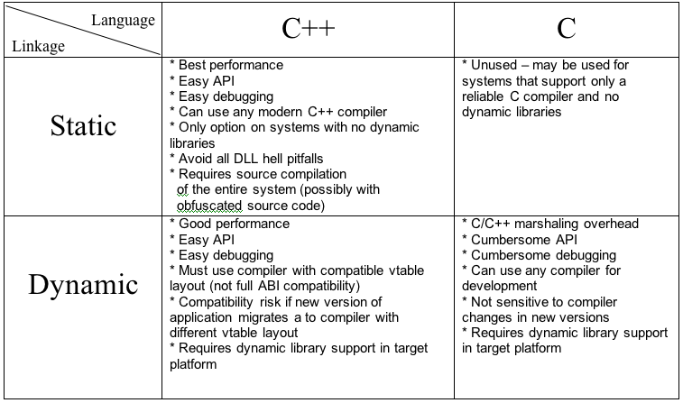

# Building Your Own Plugin Framework: Part 1
A cross-platform plugin framework for C/C++

November 25, 2007

URL: [drdobbs.com](https://www.drdobbs.com/cpp/building-your-own-plugin-framework-part/204202899)

---
*Editor's Note: This is the first installment of a five-part series by Gigi Sayfan on creating cross-platform plugins in C++. Subsequent installments are: [Part 2](Building%20Your%20Own%20Plugin%20Framework%20Part%202.md), [Part 3](Building%20Your%20Own%20Plugin%20Framework%20Part%203.md), [Part 4](Building%20Your%20Own%20Plugin%20Framework%20Part%204.md), and [Part 5](Building%20Your%20Own%20Plugin%20Framework%20Part%205.md).*

---

This article is the first in a series of articles that discuss the architecture, development, and deployment of a C/C++ cross-platform plugin framework. This first installment explores the terrain, surveys (briefly) several existing plugin/component libraries, delves into the binary compatibility problem, and presents some desirable properties of the solution.

Subsequent articles showcase an industrial strength plugin framework that you can use on Windows, Linux, Mac OS X, and easily port to other operating systems. The plugin framework has some unique properties compared to other alternatives and it is designed to be flexible, efficient, easy for application developers, easy for plugin writers, supports both C and C++, and provides multiple deployment options (as dynamic or static libraries).

I will develop as a sample application a simple role-playing game that lets you add non-player characters (NPCs) plugins. The game engine loads the plugins and seamlessly integrates their contents. The game demonstrates the concepts and shows concrete running code.

## Who Needs Plugins?
Plugins are the way to go if you want to develop a successful and dynamic system. Plugin-based extensibility is the current best practice to extend and evolve systems in a safe manner. Plugins let third-party developers add value to systems and let in-house developers add functionality without risk of destabilizing the core functionality. Plugins promote separation of concerns, guaranty implementation details hiding, isolated testing, and many other best practices.

Platforms like Eclipse are actually bare-bones frameworks where all the functionality is provided by plugins. The Eclipse IDE itself (including the UI and the Java Development Environment) is just a set of plugins hooked into the core framework.

## Why C++?
C++ is notoriously non-accommodating when it comes to plugins. C++ is extremely platform-specific and compiler-specific. The C++ standard doesn't specify an Application Binary Interface (ABI), which means that C++ libraries from different compilers or even different versions of the same compiler are incompatible. Add to that the fact that C++ has no concept of dynamic loading and each platform provide its own solution (incompatible with others) and you get the picture. There are a few heavyweight solutions that try to address more than just plugins and rely on some additional runtime support. Still, C/C++ is often the only practical option when it comes to high-performance systems.

## What's Out There?
Before embarking on a brand new framework, it's worth checking out existing libraries or frameworks. I found that there are either heavyweight solutions like Microsoft's COM and Mozilla's XPCOM (Cross-platform COM), or pretty basic offerings like Qt's plugins and a few articles about creating C++ plugins. One interesting library is [DynObj](http://dynobj.sourceforge.net/) that claims to solve the binary compatibility problem (with some restrictions). There is also a proposal for adding plugins to C++ as a native concept by [Daveed Vandervoorde](http://www.open-std.org/JTC1/SC22/WG21/docs/papers/2006/n2015.pdf). It's an interesting read, but it feels strange.

None of the basic solutions address the myriad issues associated with creating an industrial strength plugin-based system like error handling, data types, versioning, separation between framework code, and application code. Before diving into the solution, let's understand the problem.

## The Binary Compatibility Problem
Again, there is no standard C++ ABI. Different compilers (and even different versions of the same compiler) produce different object files and libraries. The most obvious manifestation of this problem is the different name mangling algorithms implemented by different compilers. This means that in general you can only link C++ object files and libraries that were compiled using exactly the same compiler (brand and version). Many compilers don't even implement standard C++ features from the C++98

There are some partial solutions to this problem. For example, if you access a C++ object only through a virtual pointer and call only its virtual methods you sidestep the name mangling issue. However, it is not guaranteed that even the virtual table layout in memory is identical between compilers, although it is more stable.

If you try to load C++ code dynamically you face another issue -- there is no direct way to load and instantiate C++ classes from a dynamic library under Linux or Mac OS X (Visual C++ supports it under Windows).

The solution to this issue is to use a function with C linkage (not name mangled by the compiler) as a factory function that returns an opaque handle to the caller. The caller then casts the handle to the appropriate class (usually a pure abstract base class). This requires some coordination, of course, and works only if the library and the application were compiled with compilers that have a matching vtable layout in memory.

The ultimate in compatibility is to just forget about C++ and expose a pure C API. C is compatible in practice between all compiler implementations. Later I'll show how to achieve C++ programming model on top of C compatibility.

## Plugin-Based System Architecture
A plugin-based system can be divided into three parts:
* The domain-specific system.
* A plugin manager.
* The plugins.

The domain-specific system loads the plugins and creates plugin objects via the plugin manager. Once a plugin object is created and the main system has some pointer/reference to it, it can be used just like any other object. Usually, there are some special destruction/cleanup requirements as we shall see.

The plugin manager is a pretty generic piece of code. It manages the life-cycle of the plugins and exposes them to the main system. It can find and load plugins, initialize them, register factory functions and be able to unload plugins. It should also let the main system iterate over loaded plugins or registered plugin objects.

The plugins themselves should conform to the plugin manager protocol and provide objects that conform to the main system expectations.

In practice, you rarely see such a clean separation (in C++-based plugin systems, anyway). The plugin manager is often tightly coupled with the domain-specific system. There is a good reason for that. Plugin managers need to provide eventually instances of plugin objects with certain type. Moreover, the initialization of the plugin often requires passing domain-specific information and/or callback functions/services. This can't be done easily with a generic plugin manager.

## Plugin Deployment Models
Plugins are usually deployed as dynamic libraries. Dynamic libraries allow many of the advantages of plugins such as hot swapping (reloading a new implementation without shutting the system), safe extension by third-party developers (additional functionality without modifying the core system), and shorter link times. However, there are situations where static libraries are the best vehicle for plugins. For example, some systems simply don't support dynamic libraries (many embedded systems). In other cases, security concerns don't allow loading foreign code. Sometimes, the core system comes with pre-loaded with some plugins and it is more robust to statically link them to the main executable (so the users can't delete them by accident).

The bottom line is that a good plugin system should support both dynamic and static plugins. This lets you deploy the same plugin-based system in different environments with different constraints.

## Plugin Programming Interface
Plugins are all about interfaces. The basic notion of plugin-based system is that there is some central system that loads plugins it knows nothing about and communicates with them through well-defined interfaces and protocols.

The naive approach is to define a set of functions as the interface that the plugin exports (either dynamic or static library). This approach is technically possible but conceptually it is flawed. The reason is that there are two kinds of interfaces a plugin should support and can be only a single set of functions exported from a plugin. This means that both kinds of interface will be mixed together.

The first interface (and protocol) is the generic plugin interface. It lets the central system initialize the plugin, and lets the plugin register with the central system various functions for creating and destroying objects as well as global cleanup function. The generic plugin interface is not domain-specific and can be specified and implemented as a reusable library. The second interface is the functional interface implemented by the plugin objects. This interface is domain-specific and must be carefully designed and implemented by the actual plugins. The central system should be aware of this interface and interact with the plugin objects through it.

Listing One is the header file that specifies the generic plugin interface. Without delving into the details and explaining anything just yet let's just see what it offers.

```c++
#ifndef PF_PLUGIN_H
#define PF_PLUGIN_H
 
#include <apr-1/apr_general.h>
 
#ifdef __cplusplus
extern "C" {
#endif
 
typedef enum PF_ProgrammingLanguage
{
  PF_ProgrammingLanguage_C,
  PF_ProgrammingLanguage_CPP
} PF_ProgrammingLanguage;
  
struct PF_PlatformServices_;
 
typedef struct PF_ObjectParams
{
  const apr_byte_t * objectType;
  const struct PF_PlatformServices_ * platformServices;
} PF_ObjectParams;
 
typedef struct PF_PluginAPI_Version
{
  apr_int32_t major;
  apr_int32_t minor;
} PF_PluginAPI_Version;
 
typedef void * (*PF_CreateFunc)(PF_ObjectParams *); 
typedef apr_int32_t (*PF_DestroyFunc)(void *);
 
typedef struct PF_RegisterParams
{
  PF_PluginAPI_Version version;
  PF_CreateFunc createFunc;
  PF_DestroyFunc destroyFunc;
  PF_ProgrammingLanguage programmingLanguage;
} PF_RegisterParams;
 
typedef apr_int32_t (*PF_RegisterFunc)(const apr_byte_t * nodeType, const PF_RegisterParams * params);
typedef apr_int32_t (*PF_InvokeServiceFunc)(const apr_byte_t * serviceName, void * serviceParams);
 
typedef struct PF_PlatformServices
{
  PF_PluginAPI_Version version;
  PF_RegisterFunc registerObject; 
  PF_InvokeServiceFunc invokeService; 
} PF_PlatformServices;
 
typedef apr_int32_t (*PF_ExitFunc)();
 
typedef PF_ExitFunc (*PF_InitFunc)(const PF_PlatformServices *);
 
#ifndef PLUGIN_API
  #ifdef WIN32
    #define PLUGIN_API __declspec(dllimport)
  #else
    #define PLUGIN_API
  #endif
#endif
 
extern
#ifdef  __cplusplus
"C"
#endif
PLUGIN_API PF_ExitFunc PF_initPlugin(const PF_PlatformServices * params);
 
#ifdef  __cplusplus
}
#endif
#endif /* PF_PLUGIN_H */
```
```Listing One```

The first thing you should notice is that it is a C file. This allows the plugin framework to be compiled and used by pure C systems and to write pure C plugins. But, it is not limited to C and is actually designed to be used mostly from C++.

The PF_ProgrammingLanguage enum allows plugins to declare to the plugin manager if they are implemented in C or C++.

The PF_ObjectParams is an abstract struct that is passed to created plugin objects.

The PF_PluginAPI_Version is used to negotiate versioning and make sure that the plugin manager loads only plugins with compatible version.

The functions pointer definitions PF_CreateFunc and PF_DestroyFunc (implemented by the plugin) allow the plugin manager to create and destroy plugin objects (each plugin registers such functions with the plugin manager)

The PF_RegisterParams struct contains all the information that a plugin must provide to the plugin manager upon initialization (version, create/destroy functions, and programming language).

The PF_RegisterFunc (implemented by the plugin manager) allows each plugin to register a PF_RegisterParams struct for each object type it supports. Note that this scheme allows a plugin to register different versions of an object and multiple object types.

The PF_InvokeService function pointer definition is a generic function that plugins can use to invoke services of the main system like logging, event notification and error reporting. The signature includes the service name and an opaque pointer to a parameters struct. The plugins should know about available services and how to invoke them (or you can implement service discovery if you wish using PF_InvokeService).

The PF_PlatformServices struct aggregates all the services I just mentioned that the platform provides to plugin (version, registering objects and the invoke service function). This struct is passed to each plugin at initialization time.

The PF_ExitFunc is the definition of the plugin exit function pointer (implemented by the plugin).

The PF_InitFunc is the definition of the plugin initialization function pointer.

The PF_initPlugin is the actual signature of the plugin initialization function of dynamic plugins (plugins deployed in dynamically linked libraries/shared libraries). It is exported by name from dynamic plugins, so the plugin manager will be able to call it when loading the plugin. It accepts a pointer to a PF_PlatformServices struct, so all the services are immediately available upon initialization (this is the right time to register objects) and it returns a pointer to an exit function.

Note that static plugins (plugins implemented in static libraries and linked directly to the main executable) should implement an init function with C linkage too, but MUST NOT name it PF_initPlugin. The reason is that if there are multiple static plugins, they will all have a function with the same name and your compiler will hate it.

Static plugins initialization is different. They must be initialized explicitly by the main executable that will call their initialization function with the PF_InitFunc signature. This is unfortunate because it means the main executable needs to be modified whenever a new static plugin is added/removed and also the names of the various init functions must be coordinated.

There is a technique called "auto-registration" that attempts to solve the problem. Auto-registration is accomplished by a global object in the static library. This object is supposed to be constructed before the main() even starts. This global object can request the plugin manager to initialize the static plugin (passing the plugin's init() function pointer). Unfortunately, this scheme doesn't work in Visual C++.

## Writing a Plugin
What does it mean to write a plugin? The plugin framework is very generic and doesn't provide any tangible objects your application can interact with. You must build your application object model on top of the plugin framework. This means that your application (that loads the plugins) and the plugins themselves will have to agree about and coordinate their interaction model. Usually it means that the application expect the plugin to provide certain types of objects that expose some specific API. The plugin framework will provide all the infrastructure necessary to register, enumerate and load those objects. Example 1 is a definition of a C++ interface called IActor. It has two operations -- getInitialInfo() and play(). Note that this interface is not sufficient because getInitialInfo() expects a pointer to a struct called ActorInfo and play() expects a pointer to yet another interface called ITurn. This is usually the case and you must design and specify a whole object model.

```c++
struct IActor
{
  virtual ~IActor() {}
  virtual void getInitialInfo(ActorInfo * info) = 0;
  virtual void play( ITurn * turnInfo) = 0;
};
```
```Example 1```

Each plugin can register multiple types that implement the IActor interface. When the application decides to instantiate an object registered by a plugin, it invokes the registered PF_CreateFunc implemented by the plugin. The plugin is responsible to create a corresponding object and return it to the application. The return type is void * because the object creation operation is part of the generic plugin framework that knows nothing about the specific IActor interface. The application then casts the void * to the an IActor * and can work with it through the interface as if it was a regular object. When the application is done with the IActor object it invokes the registered PF_DestroyFunc implemented by the plugin and the plugin destroys the actor object. Pay no attention to the virtual destructor behind the curtain. I'll discuss it in the next installment.

## Programming Language Support
In the binary compatibility section I explained that you can have C++ vtable-level compatibility if you use compilers with matching vtable layouts for the application and the plugins or you can use C-level compatibility and then you can use different compilers to build the application and the plugins, but you are limited to C interaction. Your application object model must be C-based. you can't use a nice C++ interface like IActor in Example 1, but you must devise a similar C interface.

## Pure C
In pure C programming model you simply develop your plugin in C. When you implement the PF_CreateFunc function you return a C object that interacts with further C object in your application C object model. What is all this talk about C objects and C object models. Everybody knows C is a procedural language and has no concept of objects. This is correct and still C has enough abstraction mechanism to implement objects including polymorphism (which is necessary in this case) and support object-oriented programming style. In fact, the original C++ compiler was actually a front-end to a C compiler. It produced C code from the C++ code that was later compiled using a plain C compiler. It's name [Cfront](https://en.wikipedia.org/wiki/Cfront) is more than telling.

The ticket is to use structs that contain function pointers. The signature of each function should accept its own struct as first argument. The struct may also contain other data members. This simple idiom corresponds to a C++ class and provides encapsulation (state and behavior in one place), inheritance (by using the first data member for a base struct), and polymorphism (by setting different function pointers).

C doesn't support destructors, function, and operators overloading and namespaces so you have fewer options when defining interfaces. That may be a blessing in disguise because interfaces are supposed to be used by other people who may master a different subset of the C++ language. Reducing the scope of language construct in interfaces may improve the simplicity and usability of your interfaces.

I will explore object-oriented C in the context of the plugin framework in the follow up articles. Listing Two contains the C object model of the sample game that accompanies this article series (just to whet your appetite). If you take a quick look you can see that it even supports a form of collections and iterators beyond plain objects.

```c
#ifndef C_OBJECT_MODEL
#define C_OBJECT_MODEL
 
#include <apr-1/apr.h>
 
#define MAX_STR 64 /* max string length of string fields */
 
typedef struct C_ActorInfo_
{
  apr_uint32_t id;
  apr_byte_t   name[MAX_STR];
  apr_uint32_t location_x;
  apr_uint32_t location_y;
  apr_uint32_t health;
  apr_uint32_t attack;
  apr_uint32_t defense;
  apr_uint32_t damage;
  apr_uint32_t movement;
} C_ActorInfo;
 
typedef struct C_ActorInfoIteratorHandle_ { char c; } * C_ActorInfoIteratorHandle; 
typedef struct C_ActorInfoIterator_
{
  void (*reset)(C_ActorInfoIteratorHandle handle);
  C_ActorInfo * (*next)(C_ActorInfoIteratorHandle handle);
 
  C_ActorInfoIteratorHandle handle;
} C_ActorInfoIterator;
 
typedef struct C_TurnHandle_ { char c; } * C_TurnHandle; 
typedef struct C_Turn_
{
  C_ActorInfo * (*getSelfInfo)(C_TurnHandle handle);
  C_ActorInfoIterator * (*getFriends)(C_TurnHandle handle);
  C_ActorInfoIterator * (*getFoes)(C_TurnHandle handle);
 
  void (*move)(C_TurnHandle handle, apr_uint32_t x, apr_uint32_t y);
  void (*attack)(C_TurnHandle handle, apr_uint32_t id);
 
  C_TurnHandle handle;
} C_Turn;
 
typedef struct C_ActorHandle_ { char c; } * C_ActorHandle; 
typedef struct C_Actor_
{
  void (*getInitialInfo)(C_ActorHandle handle, C_ActorInfo * info);
  void (*play)(C_ActorHandle handle, C_Turn * turn); 
 
  C_ActorHandle handle;
} C_Actor;
 
#endif
```
```Listing Two```

## Pure C++
In pure C++ programming model you simply develop your plugin in C++. The plugin programming interface functions can be implemented as static member functions or as plain static/global functions (C++ is mostly a superset of C after all). The object model can be your garden variety C++ object model. Listing Three contains the C++ object model of the sample game. It is almost identical to the C object model of Listing Two.

```c++
#ifndef OBJECT_MODEL
#define OBJECT_MODEL
 
#include "c_object_model.h"
 
typedef C_ActorInfo ActorInfo;
 
struct IActorInfoIterator
{
  virtual void reset() = 0;
  virtual ActorInfo * next() = 0;
};
 
struct ITurn
{
  virtual ActorInfo * getSelfInfo() = 0;
  virtual IActorInfoIterator * getFriends() = 0;
  virtual IActorInfoIterator * getFoes() = 0;
 
  virtual void move(apr_uint32_t x, apr_uint32_t y) = 0;
  virtual void attack(apr_uint32_t id) = 0;
};
 
struct IActor
{
  virtual ~IActor() {}
  virtual void getInitialInfo(ActorInfo * info) = 0;
  virtual void play( ITurn * turnInfo) = 0;
};
 
#endif
```
```Listing Three```

## Dual C/C++
In the dual C/C++ programming model you can develop your plugin in either C or C++. When you register your objects you specify if they are C or C++ object. This is useful if you create a platform and you want to provide third-party developers ultimate freedom to choose their programming language and programming model and mix and match C and C++ plugins.

The plugin framework supports it, but the real work is in devising a dual C/C++ object model to your application. Each object type needs to implement both C interface and the C++ interface. This means that you will have a C++ class with a standard vtable and also a bunch of function pointers that correspond to the methods of the virtual table. The mechanics are not trivial and I'll demonstrate it in the context of the sample game.

Note that from the point of view of a plugin developer the dual C/C++ model doesn't introduce any additional complexity. The plugin developer always develop either a C or a C++ plugin using C interfaces or the C++ interfaces.

## Hybrid C/C++
In hybrid C/C++ programming models, you develop your plugin in C++ but under the covers the C object model is used. This involves creating C++ wrapper classes that implement the C++ object model and wrap corresponding C objects. The plugin developers programs against this layer that translates every call, parameter and return value back and forth between C and C++. This requires additional work when implementing your application object model, but is very straight forward usually. The benefit is a nice C++ programming model for the plugin developer with a full C-level compatibility. I don't demonstrate it in the context of the sample game.

## Language-Linkage Matrix
Figure 1 shows the various pros and cons of different combinations of deployment models (static vs. dynamic libraries) and programming language choice (C vs. C++).


```Figure 1```

For the sake of this discussion the dual C/C++ model has the prerequisites and limitations of C++ if using C++ plugins and the prerequisites and limitations of C if using C plugins. Also, the hybrid C/C++ model is just a C model because the C++ layer is hidden behind the plugin implementation. This can all be confusing, but the bottom line is that you have options and the plugin framework allows you to make choices and pick the tradeoffs you feel appropriate to your situation. It doesn't force you to use a specific model and it doesn't aim to lowest common denominator.

---
*Gigi Sayfan specializes in cross-platform object-oriented programming in C/C++/ C#/Python/Java with emphasis on large-scale distributed systems. He is currently trying to build intelligent machines inspired by the brain at Numenta (www.numenta.com).*

---