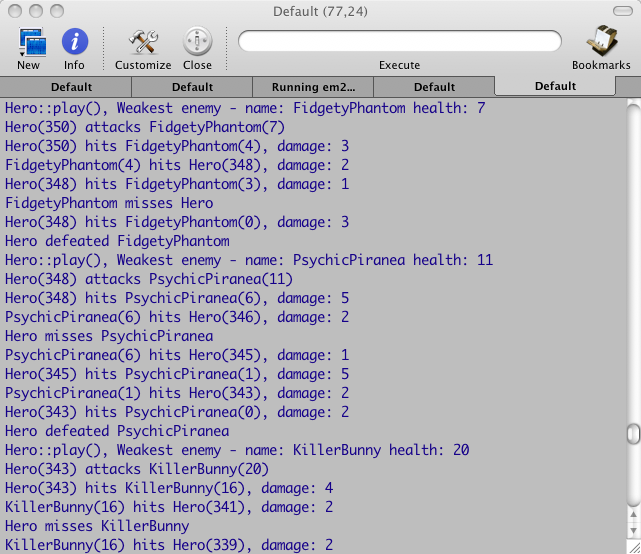
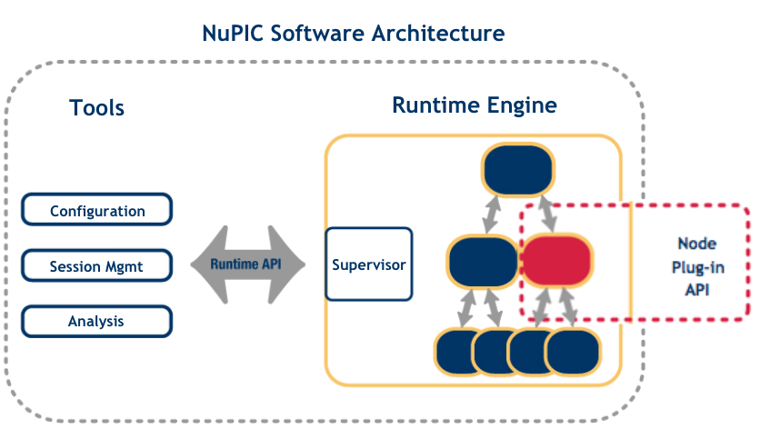

# Building Your Own Plugin Framework: Part 5
The plugins, the source, the game, and the wrap-up

February 13, 2008

URL: [drdobbs.com](https://www.drdobbs.com/cpp/building-your-own-plugin-framework-part/206503957)

---

This is the final article in a series about developing cross-platform plugins in C++. In previous articles -- [Part 1](Building%20Your%20Own%20Plugin%20Framework%20Part%201.md), [Part 2](Building%20Your%20Own%20Plugin%20Framework%20Part%202.md), [Part 3](Building%20Your%20Own%20Plugin%20Framework%20Part%203.md), and [Part 4](Building%20Your%20Own%20Plugin%20Framework%20Part%204.md) -- I examined the difficulties of working with C++ plugins in portable way.

In this installment, I cover the missing pieces of the sample game introduced in Part 4 and give a demonstration. I also take a quick tour of the [source code](http://twimgs.com/ddj/images/article/2008/code/plugin.zip) that accompanies this series, tell a few good stories (it's about time), and finally compare the plugin framework to the [NuPIC](https://numenta.com/for-developers/software/pdf/nupic_prog_guide.pdf) (Numenta's Platform for Intelligent Computing) plugin framework, which is its conceptual ancestor. But first, let's take a look at some monster plugins that will be loaded into the game.

## Monster Plugins
I created four different plugins to demonstrate the scope and diversity of the plugin framework.
* A pure C++ plugin
* A pure C plugin
* A hybrid plugin deployed as dynamic/shared libraries
* One static C++ plugin that should be linked directly to the executable.

All these plugins register their monsters with the PluginManager as actors. In addition, the game itself implements the **Hero** as an object that implements the **IActor** interface and large parts of the code that work at the **IActor** interface don't (and can't distinguish) between the game-supplied **Hero** and any monster. The game could also provide some built-in monsters.

## Dynamic C++ Plugins
The dynamic C++ plugin registers the **KillerBunny** and **StationarySatan** monsters. Listing One is the KillerBunny.h header where the **KillerBunny** class is defined. **KillerBunny** is derived directly from the C++ **IActor** interface (which makes it a pure C++ plugin). It implements the **create()** and **destroy()** static functions to support creation and destruction via the PluginManager. The **StationarySatan** and any other pure C++ plugin object should look exactly the same (except for private members if any).

```c++
#ifndef KILLER_BUNNY_H
#define KILLER_BUNNY_H
#include <object_model/object_model.h>
struct PF_ObjectParams;
class KillerBunny : public IActor
{
public:
  // static plugin interface
  static void * create(PF_ObjectParams *); 
  static apr_int32_t destroy(void *);
  ~KillerBunny();
  // IActor methods
  virtual void getInitialInfo(ActorInfo * info);
  virtual void play(ITurn * turnInfo);
private:
  KillerBunny();
};
#endif
```
```Listing One```

Example 1 contains the implementation of **create()** and **destroy()**. They are almost trivial. The **create()** function simply instantiates a new **KillerBunny** object and returns it (as opaque **void** pointer). The **destroy()** function accepts a **void** pointer, which is actually a pointer to an instance created earlier using the **create()** function. It casts the **void** pointer to a **KillerBunny** pointer and deletes it. The important part here is that these functions let the PluginManager create **KillerBunny** objects without "knowing" anything about the **KillerBunny** class. The returned instance is usable via the **IActor** interface later (even though it is returned as a **void** pointer).

```c++
void * KillerBunny::create(PF_ObjectParams *)
{
  return new KillerBunny();
}
apr_int32_t KillerBunny::destroy(void * p)
{
  if (!p)
    return -1;
  delete (KillerBunny *)p;
  return 0;
}
```
```Example 1```

Example 2 contains the implementation of the **IActor** interface methods. These methods are trivial too. The **getInitialInfo()** method simply populates the **ActorInfo** struct with some data. The **play()** method is where a real **KillerBunny** will do the actual work, run around, avoid or attack enemies, and generally justify its name. Here, it just gets the list of friends from the **ITurn** interface to verify it works. This is just laziness on my part, and in fact all the monsters don't do anything. The **Hero** is the only one actually fighting. The monsters do defend themselves when attacked and even retaliate.

```c++
void KillerBunny::getInitialInfo(ActorInfo * info)
{
  ::strcpy((char *)info->name, "KillerBunny");
  info->attack = 10;
  info->damage = 3;
  info->defense = 8;
  info->health = 20;
  info->movement = 2;
 
  // Irrelevant. Will be assigned by system later
  info->id = 0;
  info->location_x = 0;
  info->location_y = 0;
}
void KillerBunny::play(ITurn * turnInfo)
{
  IActorInfoIterator * friends = turnInfo->getFriends();
}
```
```Example 2```

The main point here is that writing pure C++ plugin objects is pretty easy. Other than the boilerplate **create()** and **destroy()** static methods, you just implement a standard C++ class. No arcane incantations are required.

Listing Two contains the plugin initialization code. It's not too bad, but it's boring and error prone: Define an exit function, in the **PF_initPlugin** function, define a **PF_RegisterParams** struct, populate it, and register every plugin object. Make sure you return NULL if initialization failed. Less than exhilarating. That's all it takes to write a pure C++ monster plugin (with two monsters).

```c++
#include "cpp_plugin.h"
#include "plugin_framework/plugin.h"
#include "KillerBunny.h"
#include "StationarySatan.h"
 
extern "C" PLUGIN_API apr_int32_t ExitFunc()
{
  return 0;
}
extern "C" PLUGIN_API PF_ExitFunc PF_initPlugin(const PF_PlatformServices * params)
{
  int res = 0;
     
  PF_RegisterParams rp;
  rp.version.major = 1;
  rp.version.minor = 0;
  rp.programmingLanguage = PF_ProgrammingLanguage_CPP;
   
  // Register KillerBunny
  rp.createFunc = KillerBunny::create;
  rp.destroyFunc = KillerBunny::destroy;
  res = params->registerObject((const apr_byte_t *)"KillerBunny", &rp);
  if (res < 0)
    return NULL;
 
  // Regiater StationarySatan
  rp.createFunc = StationarySatan::create;
  rp.destroyFunc = StationarySatan::destroy;
  res = params->registerObject((const apr_byte_t *)"StationarySatan", &rp);
  if (res < 0)
    return NULL;
 
  return ExitFunc;
}
```
```Listing Two```

## Static C++ Plugins
Listing Three is the initialization code of the static plugin. It is also a C++ plugin, but it is initialized differently. All dynamic plugins (both C and C++) must implement the well-known entry point function **PF_initPlugin**. This is what the PluginManager is looking to initialize. Static plugins, on the other hand, are statically linked to the application. That means that if two plugins implement the same function name, a name clash occurs and the application fails to link. So static plugins must have a unique initialization function and the main application must know about it to initialize it at the beginning of the program. Once the initialization function has been called, static plugins are indistinguishable from any other plugin. The last line defines a Plugin Register instance. This non-portable technique works on non-Windows platforms and allows static plugins to register themselves. This is nice and saves the application code from tight coupling with static plugins (other than linking). It makes it easy to add new static plugins just by changing the build system and without recompiling existing code.

Static plugin objects look just dynamic plugin objects and implement the **IActor** interface. Example 3 contains the **play()** method of the **FidgetyPhantom** class that the static plugin registers with the PluginManager. The **FidgetyPhantom** is actually doing something in its **play()** method. It is a good example of a plugin object using objects created and managed by the application via the object model interfaces. **FidgetyPhantom** gets the first foe (usually the **Hero**), moves towards him, and attacks, if possible. It is uses the **findClosest()** utility function to find the closest point (restricted by its movement points) to its foe and moves towards this point. If it reaches its enemy, it attacks.

```c++
void FidgetyPhantom::play( ITurn * turnInfo)
{
  // Get self
  const ActorInfo * self = turnInfo->getSelfInfo();
 
  // Get first foe
  IActorInfoIterator * foes = turnInfo->getFoes();
  ActorInfo * foe  = foes->next();
   
  // Move towards and attack the first foe (usually the hero)
  Position p1(self->location_x, self->location_y);
  Position p2(foe->location_x, foe->location_y);
 
  Position closest = findClosest(p1, p2, self->movement);
  turnInfo->move(closest.first, closest.second);
  if (closest == p2)
    turnInfo->attack(foe->id);
}
```
```Example 3```

## Dynamic C Plugins
C plugins register objects that implement the **C_Actor** interface. The plugin itself -- and even the **C_Actor** implementation -- may be C++ classes (using static methods). In this case, I implemented everything in C, just to ensure the system supports pure C plugins (there were a few compilation gotchas before it worked). The C plugin registers a single monster called **MellowMonster**. The header file of this quaint monster is presented in Example 4. This is a C object, so there is no class definition only the global functions **MellowMonster_create()** and **MellowMonster_destroy()**, which correspond to **PF_CreateFunc** and **PF_DestroyFunc**. The names are qualified with the **monster** type because, in general, a single plugin may register monster types with different pairs of **create()/destroy()** functions and in C we can't hide them in a namespace or as static methods of a class.

```c++
#ifndef MELLOW_MONSTER_H
#define MELLOW_MONSTER_H
 
#include <plugin_framework/plugin.h>
 
// static plugin interface
void * MellowMonster_create(PF_ObjectParams *); 
apr_int32_t MellowMonster_destroy(void *);
 
#endif
```
```Example 4```

Example 5 presents the actual monster. It's just a **struct** that contains a **C_Actor** member and optionally more monster-specific data. Not much of a monster so far.

```c++
typedef struct MellowMonster_
{
  C_Actor actor;
 
  /* additional monster-specific data */
  apr_uint32_t dummy;
 
} MellowMonster;
```
```Example 5```

Example 6 is the implementation of the **C_Actor** interface and consists of two static functions (not visible outside of this compilation unit) -- **MellowMonster_getInitialInfo()** and **MellowMonster_play()** -- that correspond to the **IActor** methods. The big difference is that the C++ methods get the object instance as the implicit **'this'** pointer. In C, you must pass a **C_ActorHandle** explicitly (well, not you, but the PluginManager) and the C functions laboriously cast the handle to a **MellowMonster** pointer. When the **C_Turn** object is used in the **play()** function, you must pass it its own handle too.

```c++
void MellowMonster_getInitialInfo(C_ActorHandle handle, C_ActorInfo * info)
{
  MellowMonster * mm = (MellowMonster *)handle;
  strcpy((char *)info->name, "MellowMonster");
  info->attack = 10;
  info->damage = 3;
  info->defense = 8;
  info->health = 20;
  info->movement = 2;
 
  /* Irrelevant. Will be assigned by system later */
  info->id = 0;
  info->location_x = 0;
  info->location_y = 0;
}
void MellowMonster_play(C_ActorHandle handle, C_Turn * turn)
{
  MellowMonster * mm = (MellowMonster *)handle;
  C_ActorInfoIterator * friends = turn->getFriends(turn->handle);
}
```
```Example 6```

Example 7 contains the **MellowMonster_create()** and **MellowMonster_destroy()** functions and ties up loose ends. The **MellowMonster_create()** function allocates a **MellowMonster** struct (using **malloc**, of course), assigns the pointer to the handle member of the actor field (without checking if the memory allocation failed, boo :-), and goes one to assign the **MellowMonster_getInitialInfo()** and **MellowMonster_play()** functions to proper function pointers. Finally it returns the **MellowMonster** pointer as an opaque **void** pointer. It is important that the **C_Actor** interface be the first member of the **MellowMonster** struct, because the PluginManager (via the adapter) casts the returned **void** pointer to a **C_Actor** pointer and treats it as such from then on.

The **MellowMonster_destroy()** frees the memory. If there is any need for destructor-like cleanup, it can do it too.

Let's check the initialization code of the C plugin in Listing Four. It looks just like the C++ plugin. This isn't surprising because it is a C function that needs to prepare a C struct and call yet another C function. The only real difference is that the registered programming language for **MellowMonster** is **PF_ProgrammingLanguage_C**. That tells the PluginManager that it's dealing with a C object and it should adapt it.

```c++
#ifdef WIN32
#include "stdafx.h"
#endif
 
#include "c_plugin.h"
#include "c_plugin.h"
#include "plugin_framework/plugin.h"
#include "MellowMonster.h"
 
PLUGIN_API apr_int32_t ExitFunc()
{
  return 0;
}
 
PLUGIN_API PF_ExitFunc PF_initPlugin(const PF_PlatformServices * params)
{
  int res = 0;
     
  PF_RegisterParams rp;
  rp.version.major = 1;
  rp.version.minor = 0;
   
  // Regiater MellowMonster
  rp.createFunc = MellowMonster_create;
  rp.destroyFunc = MellowMonster_destroy;
  rp.programmingLanguage = PF_ProgrammingLanguage_C;
   
  res = params->registerObject((const apr_byte_t *)"MellowMonster", &rp);
  if (res < 0)
    return NULL;
 
  return ExitFunc;
}
```
```Listing Four```

As you can see, working at the C API level is much thornier. You need pass explicit handles around, cast a lot, pay attention to function names, and hook up free functions to your monster **C_Actor** interfaces. It's not fun, but it's survivable if you must work with C.

## Hybrid C/C++ Plugins
So C is cumbersome and you would like to use the C++ API, but you must provide total binary compatibility. What a conundrum. Fortunately, the Hybrid C/C++ plugin is just the ticket. It provides C compatibility with a C++ API via **ActorBaseTemplate**. It also cuts down significantly on the plugin initialization code by using **PluginHelper**. The plugin registers two monsters: **GnarlyGolem** and **PsychicPiranea**. Both derive from **ActorBaseTemplate** and both implement the C++ **IActor** interface, but **GnarlyGolem** is actually talking in C to the PluginManager while **PsychicPiranea** is talking C++.

Example 8 contains the definitions of both classes. You can see how compact and clean they look. There is no need for the **create()** or **destroy()** static methods anymore (**ActorBaseTemplate** takes care of it). The only difference between the two is that **PsychicPiranea** specifies the **IActor** as the second template parameter for **ActorBaseTemplate**. This is the infamous **Interface** parameter, which is **C_Actor** by default.

```c++
class GnarlyGolem : public ActorBaseTemplate<GnarlyGolem>
{
public:
  GnarlyGolem(PF_ObjectParams *);
  // IActor methods
  virtual void getInitialInfo(ActorInfo * info);
  virtual void play(ITurn * turnInfo);
};
class PsychicPiranea : public ActorBaseTemplate<PsychicPiranea, IActor>
{
public:
  PsychicPiranea(PF_ObjectParams *);
  // IActor methods
  virtual void getInitialInfo(ActorInfo * info);
  virtual void play(ITurn * turnInfo);
};
```
```Example 8```

**PsychicPiranea** could have been been derived from **IActor** directly, just like **KillerBunny** and **StationarySatan** in the C++ plugin. The reason it derives from **ActorBaseTemplate** is threefold:
* It saves you from write **create()/destroy()** static methods
* It lets you switch quickly between C and C++ if you deploy the same plugins in different situations
* So I can demonstrate this cool capability

This is really cool because between the automatic adaptation of C objects by the PluginManager and the nice C++ wrapper that **ActorBaseTemplate** provides, application developers and plugin developers can be blissfully ignorant of the C that flows between them. The only developers who should be concerned with the C/C++ dualism are the object model developers. If your system is a serious platform, then the object model will congeal sooner or later. Then everyone can forget about C and just extend the application that's built on top of the object model and write lots of plugins -- all in C++.

The implementation of **GnarlyGolem** and **PsychicPiranea** is of typical C++ plugin implementations. **GnarlyGolem** is C under the covers, but it doesn't care.

Listing Five is the initialization code of the hybrid plugin. There are more **#include** statements than code. (I kid you not. Count them. This is as close to a domain-specific language as it gets -- without macros, anyway.) You define a **PluginHelper** object and call **registerObject()** for each object. No need for annoying structs with lots of function pointers, no need for error checking. Pure simplicity. In the end, return the result.

```c++
#include "wrapper_plugin.h"
#include "plugin_framework/plugin.h"
#include "plugin_framework/PluginHelper.h"
#include "GnarlyGolem.h"
#include "PsychicPiranea.h"
 
extern "C" PLUGIN_API 
PF_ExitFunc PF_initPlugin(const PF_PlatformServices * params)
{
  PluginHelper p(params);
  p.registerObject<GnarlyGolem>((const apr_byte_t *)"GnarlyGolem");
  p.registerObject<PsychicPiranea>((const apr_byte_t *)"PsychicPiranea", PF_ProgrammingLanguage_CPP);
 
  return p.getResult();
}
```
```Listing Five```

There is one nit to pick. When registering the PsychicPiranea, you need to specify PF_ProgrammingLanguage_CPP (the default is PF_ProgrammingLanguage_C). The programming language can be gleaned automatically from the PsychicPiranea class itself because it passed the programming language as the Interface parameter to the ActorBaseTemplate. However, this requires some template meta-programming tricks (type detection) and I'm running out of scope quickly. Here is a quick link if you're curious: www.ddj.com/cpp/184402050.

## Let's Play!
It's play time. I'll take you now to a quick tour of the game itself. You will see how the PluginManager is initialized, how the monsters are created and how battles are conducted. Let's start with **main()**.

Listing Six contains the **main()** function. You can skip all the **#include** statements and concentrate on the **DummyInvokeService()** function. This function serves as the **invokeService** in the **PF_PlatformServices** struct that the plugins receive. It doesn't do anything in this case, but in real applications it has a major role in providing system services to plugins.

```c++
#ifdef WIN32
#include "stdafx.h"
#endif
 
#include "plugin_framework/PluginManager.h"
#include "plugin_framework/Path.h"
#include "BattleManager.h"
#include "static_plugin/static_plugin.h"
#include <string>
#include <iostream>
 
using std::cout;
using std::endl;
 
apr_int32_t DummyInvokeService(const apr_byte_t * serviceName, void * serviceParams)
{
  return 0;
}
 
#ifdef WIN32
int _tmain(int argc, _TCHAR* argv[])
#else
int main (int argc, char * argv[])
#endif
{
  cout << "Welcome to the great game!" << endl;
  if (argc != 2)
  {
    cout << "Usage: great_game <plugins dir>" << endl;
    return -1;
  }
  // Initialization
  ::apr_initialize();
  PluginManager & pm = PluginManager::getInstance();
  pm.getPlatformServices().invokeService = DummyInvokeService;
  pm.loadAll(Path::makeAbsolute(argv[1]));
  PluginManager::initializePlugin(StaticPlugin_InitPlugin);
 
  // Activate the battle manager
  BattleManager::getInstance().go();
 
  ::apr_terminate();
 
  return 0;
}
```
```Listing Five```

The **main()** function is defined to conform to both Windows and UNIX systems. The game is very portable. I tested it on Windows XP SP2, Vista, Mac OS X 10.4 (Tiger), Mac OS X 10.5 (Leopard), and Kubuntu 7.10 (Gutsy Gibbon). These are the most common modern OS out there. It will probably work as-is or with tweaks to the build procedure on a range of other OSs.

Inside **main()** there is a check that the user passed the plugin directory as a command-line argument. The APR library is initialized and the PluginManager makes its entrance. It is a singleton and is destructed when the application terminates. The next step is to assign **DummyInvokeService** to the platform services struct. Once **invokeService** is ready, the plugins can be initialized. First, all of the dynamic plugins are loaded from the directory and passed as ```**argv[1]**```, then the static plugin is initialized explicitly. This is unpleasant, but I couldn't find a portable solution that works on Windows. Once all the plugins are initialized, BattleManager takes command. Finally, the APR library is cleaned up.

Pretty straightforward: Check command-line arguments, initialize global resources, load plugins, transfer control to the application logic, and clean up global resources.

BattleManager is the brain of the game. Example 9 contains the entire **go()** method. It starts by extracting all the registered monster types from the PluginManager.

```c++
void BattleManager::go()
{
  // Get all monster types
  PluginManager & pm = PluginManager::getInstance();
  const PluginManager::RegistrationMap & rm = pm.getRegistrationMap();
 
  for (PluginManager::RegistrationMap::const_iterator i = rm.begin(); i != rm.end(); ++i)
  {
    monsterTypes_.push_back(i->first);
  }
 
  // Dump all the monsters
  for (MonsterTypeVec::iterator i = monsterTypes_.begin(); i != monsterTypes_.end(); ++i)
  {
    std::string m = *i;
    std::cout << m.c_str() << std::endl;
  }
 
  // Add the Hero to its faction (later allies may join)
  ActorInfo ai, heroInfo;
  hero_.getInitialInfo(&heroInfo);
  // Don't keep the hero's IActor *, because she is treated differently
  actors_.insert(std::make_pair((IActor *)0, heroInfo));
  heroFaction_.push_back(&actors_[0]);
 
  // Instantiate some monsters randomly
  for (apr_int32_t i = 0; i < MONSTER_COUNT; ++i)
  {
    IActor * monster = createRandomMonster(rm);
    monster->getInitialInfo(&ai);
    ai.id = i+1; // Hero is id 0
    actors_.insert(std::make_pair(monster, ai));
     
    enemyFaction_.push_back(&actors_[monster]);
  }
 
  while (!gameOver_)
  {
    playTurn();
  }
 
  heroInfo = actors_[0];
  if (heroInfo.health > 0)
    std::cout << "Hero is victorious!!!" << std::endl;
  else
    std::cout << "Hero is dead :-(" << std::endl;
}
```
```Example 9```

This is a dynamic step. BattleManager doesn't have a clue what monsters are there -- and doesn't care. It doesn't even know about the **FidgetyPhantom** from the static plugin. It dumps all the monster types to the console for good measure (and for me to make sure all the monsters were registered properly). Then it puts the **Hero** (which is known and gets special treatment) in the actors list. BattleManager needs to know about **Hero** because the fate of **Hero** is linked with the fate of the entire game and the all important "game over" condition. Then the monsters are created randomly using the **createRandomMonster()** function. Finally, we get to the main loop: "while the game is not over play a turn". When the game is over, it's time to display a dazzling text message to the console, which states if the hero won or died. As you can see, my art budget for this game was pure fiction.

Example 10 contains the **createRandomMonster()** method. It selects a random monster by index, based on the total number of registered monster types, then creates it by calling the **ActorFactory::createActor()** method, passing it the monster type.

```c++
IActor * BattleManager::createRandomMonster(const PluginManager::RegistrationMap & rm)
{
  // Select monster type
  apr_size_t index = ::rand() % monsterTypes_.size();
  const std::string & key = monsterTypes_[index];
  const PF_RegisterParams & rp = rm.find(key)->second;
  // Create it
  IActor * monster = ActorFactory::createActor(key);
   
  return monster;
}
```
```Example 10```

The **ActorFactory** is the application-specific object adapter that derives from the generic **ObjectAdapter** provided by the plugin framework. From the point of view of the BattleManager, all created monsters are just objects the implement the **IActor** interface. The fact that some of them are adapted C objects or that some hail from remote plugins is immaterial.

This is a turn-based game, so what happens when a turn is played in the main loop? Example 11 contains the **playTurn()** method, which provides the answer.

```c++
void BattleManager::playTurn()
{
  // Iterate over all actors (start with Hero)
  //For each actor prepare turn info (friends and foes)
  Turn t;
 
  ActorInfo & ai = actors_[(IActor *)0];
  t.self = &ai;
  std::copy(heroFaction_.begin(), heroFaction_.end(), std::back_inserter(t.friends.vec));
  std::copy(enemyFaction_.begin(), enemyFaction_.end(), std::back_inserter(t.foes.vec));
  hero_.play(&t);
 
  ActorInfo * p = NULL;
  ActorMap::iterator it;
  for (it = actors_.begin(); it != actors_.end(); ++it)
  {
    if (!it->first || isDead(&it->second))
      continue;
     
    t.self = &(it->second);
    std::copy(heroFaction_.begin(), heroFaction_.end(), std::back_inserter(t.foes.vec));
    std::copy(enemyFaction_.begin(), enemyFaction_.end(), std::back_inserter(t.friends.vec));
 
    it->first->play(&t);
  }
   
  // Clean up dead enemies
  Faction::iterator last = std::remove_if(enemyFaction_.begin(), enemyFaction_.end(), isDead);
  while (last != enemyFaction_.end())
  {
    enemyFaction_.erase(last++);
  }
 
  // Check if game is over (hero dead or all enemies are dead)
  if (isDead(&actors_[(IActor *)0]) || enemyFaction_.empty())
  {
    gameOver_ = true;
    return;
  }
}
```
```Example 11```

The BattleManager starts by creating a **Turn** object on the stack. Each [live] actor getx his **Turn** object with proper information and acts on it. The **Hero** goes first. The BattleManager invokes its **play()** method, passing the turn object. The **Hero** moves about and attacks. The BattleManager is aware of all the action that transpires because the data structures that are manipulated are the **ActorInfo** structs the BattleManager manages. Once the hero is done, each of the other actors gets its chance to do some mayhem. After all the actors do their worst, it's time to remove the bodies from the battle field. This is done with the help of the standard **std::remove_if** algorithm and the **isDead()** predicate that checks if the actor has zero health points. Before the turn ends, the BattleManager checks if the **Hero** or all the monsters are dead. The game goes on until one of these conditions is fulfilled. Figure 1 shows the game in progress.



That's it. Go ahead and give it a try, but don't go addict on me :-)

## Source Code Walkthrough
Okay, there is a lot of [source code](http://twimgs.com/ddj/images/article/2008/code/plugin.zip). This subject is complicated and I didn't want to give just a couple of snippets of sample code and half-baked libraries. I put a lot of effort in organizing the code in a reusable form. I divided the code to multiple libraries and directories according to their function and their dependencies on other libraries. There is one core library, two game-specific libraries, the game itself (the executable), and four different plugins (three dynamic libraries and one static library). In addition, there are two third-party libraries -- [APR](http://apr.apache.org/) and [boost](http://www.boost.org/). Finally there are the build system(s) for the various platforms.

## Directory Structure
There are three top-level directories: include, lib, and projects. include and lib contain the external libraries and projects include the code I wrote. Inside include and lib are subdirectories for darwin86, linux32, and win32, that contain the platform-specific header files (in include) and static libraries. Actually, the only real library is APR because I use only header files from Boost that don't require building and they are identical on all platforms. So Boost resides directly under include and not in platform specific subdirectory.

## Source Code
All the source code is in subdirectories under "projects":
* **plugin_framework**. This is the core library that contains the portability layer (DynamicLibrary, Directory and Path), the plugin API definitions (plugin.h) and all the support and helper objects. You will need this library for your plugin-based systems. You may wish to put the OS portability classes in a separate library or replace them with your OS abstraction layer. I put them in the same library to make it self contained (see caveat below in the external libraries section).
* **utils**. This is a silly little library that contains two functions: **calcDistance** and **findClosest**. The reason it is a library is because it is used by the **Hero** which is part of the main executable and by some of the plugin objects, so it needs to be linked to multiple binaries. You can safely ignore it.
* **object_model**. This is where all the game-specific dual C/C++ objects reside, along with **ActorFactory**, the object model wrappers and the **ActorBaseTemplate** classes used by the hybrid plugins. If you want to use this plugin framework for your own projects, then this library gives you a blueprint of all the stuff you need to implement. It is important to note that you can pick and choose. If you don't care about C compatibility because you build the main system and all the plugins, then you can just get rid of all the C stuff. If on the other hand you care about C but you don't want to provide nice hybrid C/C++ API to plugin developers, you can just ignore the **ActorBaseTemplate** and the object model wrappers. Read the article again (especially Parts 3 and 4) with the code nearby and you will know what to do.

    <sup>The plugin libraries are straightforward. c_plugin is the C plugin (**MellowMonster**), cpp_plugin is the direct C++ plugin (**KillerBunny** and **StationarySatan**), static_plugin is the statically linked plugin (**FidgetyPhantom**) and wrapper_plugin is the hybrid C/C++ plugin (**GnarlyGolem** and **PsychicPiranea**. In most situations, **wrapper_plugin** is the right choice. It is easy to write plugins if you invest in writing the base template and object model wrappers. The plugin related overhead is practically zero.</sup>

* **great_game**. This is the game itself. It contains the Hero and BattleManager and of course the **main()** function. It gives you a good feel for how to bootstrap the whole process and what is involved in integrating the PluginManager with an application.

This article series covers the code well and explains the reasons for design decisions and trade offs. I tried to maintain a clean and consistent style. The plugin_framework and the object_model libraries, which are the heart of the system, are pretty close to industrial-strength level (maybe with a little more error handling and documentation). The rest of the code demonstrates the entire system in action. The only part that I didn't demonstrate convincingly is the **invokeService()** call. All the mechanisms are in place though. I invoke my author privileges and assign it as the dread exercise to the reader to implement a couple of services in the **DummyInvokeService()** function in great_game.cpp

## External Libraries
The game and the framework use two external libraries: [APR](http://apr.apache.org/) and [boost](http://www.boost.org/). The Apache Portable Runtime (APR) is a C library. I use its portable basic types (all the apr_xxx_t thingies) and some (very little) of its OS abstraction capabilities. I implemented most of the portable OS layer (DynamicLibrary, Directory, and Path) directly as alternative implementations on top native Windows and POSIX APIs. Boost is used mostly for its **shared_ptr** and **scoped_ptr** templates. This is very small ROI (return on investment) for burdening oneself with external dependencies, especially in the context of a cross-platform portable system. This is true. I considered removing all the dependencies and implement what little I needed from APR directly, have my own portable basic types header, and grab a smart pointer template instead of dragging Boost. I decided to leave them in to show that this is indeed a serious system that can cater to different needs and integrate with external libraries. I paid a price for it as you will hear soon enough.

## Building the Sample Game and Its Plugins
I put a lot of effort into this part because going cross-platform can increase the complexity of a system by an order of magnitude. If you don't use proper tools and processes you can spend a lot of time chasing platform-specific issues.

* **Windows**. I provide a Visual Studio 2005 solution file in the root directory. This is preferred development environment for 99.99% of Windows developers. Visual Studio Express is free for all, so there is no cost. Some people think that cross-platform development means a single build system. I'm not one of them. I had my share of bad experiences with cygwin and MinGW. It's nice when it works and it's terrible when it doesn't. It is definitely a chore to keep multiple build systems in sync. Maybe in a future article I'll explore this issue further.
* Mac OS X. On the Mac (and Kubuntu) I used NetBeans 6.0. I can't tell you how impressed I am. It is an amazing C++ development environment. It comes this close ("putting two fingers very close to each other") to Visual Studio. It totally blows Eclipse CDT (C/C++ development tools). The only annoying part (that Visual Studio gets right) is that when you set project properties like preprocessor symbols, compiler flags, etc., you must do it separately for each project even if you have 20 or 200 projects that need the same settings. The other part where NetBeans is a little weak is the debugger. It uses GDB, which is not a stellar C++ debugger (did you ever managed to probe into an **std::map** in gdb?). The best part about NetBeans 6.0 (and earlier versions too) is that it uses Makefiles as its underlying build system. That means that you can deploy your source code to anyone (as I'm doing here) and they'll be able to do: "./configure; make" and run your application. I still encourage you to get NetBeans 6.0 if you don't develop exclusively on Windows.
* **Linux (Kubuntu 7.10)**. Punch line: Eventually, I got it working. The story starts with me assuming I can just take my nice NetBeans project from the Mac and it works with a minor tweak or two. Think again. Kubuntu 7.10 comes with NetBeans 5.5.1 installed. I was happy and just tried to browse to my project. Nope. It turns out that only the Java environment is installed. Okay, I tried to update, but the C++ pack wasn't available. Okay, moving on. I tried to download the sources from NetBeans.org and build it, but I was informed that JDK1.6 update 3 is required. I tried to apt-get it and Kubuntu asks me for the installation CD. Now, I'm running in a VM that I installed from an .iso image. I deleted the 4+ GBytes .iso image because I didn't think I'll need it (why can't I update from the web?). I didn't want to download 4+ gigs, so I gave up on NetBeans and I opted to use KDevelop. It is the native KDE development environment, C++ is its strong suite and I knew that it uses automake/autoconf as its underlying build system. I had about 10 projects, but I wanted to check it out and see how easy it is to crank top-notch automake-based solution with multiple sub-projects. Well, I failed. I don't remember all the details, but I failed. I remember that it took a few minutes to locate the Automake manager (a vertical tab on the right-side of the IDE, when all the important tabs are on the left, you can move it to left when you find it). I decided to fall back to command line. It is Linux after all. People can get by without a flashy GUI IDE. I took my NetBeans-generated Makefile-based projects and started configuring and building. I had to "sed s/GNU-MacOSX/GNU-Linux-x86/g -i" a couple of times and a few more serious tweaks like replacing the linker flags (it turns out on the Mac its totally different) and I got pretty far. All the projects compiled and all the plugins linked successfully. Only, the great_game itself wouldn't link due to APR failures (couldn't find pthreads mostly). It didn't make sense pthreads is installed of course. I tried to apt-get just to see if there are some dev libraries missing. Nada. My pre-built APR library (actually two libraries) was built on a different linux distro. I download the APR source and tried to build from source. It built just fine, but I still got the same link errors.

I got really upset and grudgingly bit the bullet. I re-downloaded the Kubuntu-7.10 huge .iso image and mounted it. Things went downhill from here. I installed the JDK 1.6 update 3 through apt-get, and got and installed NetBeans 6.0 C++ pack from NetBeans.org. It created an icon on the desktop and I launched NetBeans. It loaded the Mac project files just fine and I had to make a couple of minor modifications and one more serious one. It turns out I had to add pthreads explicitly to the project, where on the Mac it just worked. So much for a unified build system. Finally all was well, after a few mistrials (I built the plugins into the wrong directory), I got everything working.

The Mac and Linux builds share the same Makefile in each project directory. This shared Makefile includes other files from a sub-directory called nbproject. Some of these files are different for the Mac and Linux. I wanted to ship build systems for both so I created two subdirectories under each project called nbproject.mac and nbproject.linux . This means that if you try to open these projects on the Mac or Linux with NetBeans, you will fail. You need to rename the appropriate sud-directory (based on your platform) to nbproject. This is annoying when you have eight different projects, so I created a little shell script called build.sh in the root directory. You should run it with either 'mac' or 'linux' and it copies the nbproject.mac or nbproject.linux to nbproject in each project and even runs make. You need to do it just once and then you will be able to open the projects in NetBeans.

## Building External Libraries
The good news are that you don't have to. I provide pre-built static libraries for APR for all the platforms and the subset of Boost I use is just header files so no need to build it.

There is a little story here too. Cross-platform development is a difficult undertaking, so companies usually start with one platform and when they grow up and mature and the codebase stabilizes, they port to other platforms. Numenta (the company I work for) had a different idea. They decided to go cross-platform from the get-go, but only do Mac and Linux. This is probably the only company EVER to do that. When we launched our research platform, the most common complaint was the absence of a Windows version. I just completed the second phase of the NuPIC plugin framework. This is the ancestor of the plugin framework and all the idioms I present here. I quickly volunteered to take on the Windows port. I was the only developer with significant Windows expertise (all the other guys are UNIX gurus), but mostly I wanted to be able to debug in Visual Studio and forget about gdb. Our codebase was pretty much high-level standard C++. There were quiet a few direct system calls and many UNIX path issues, but nothing too terrible. All was going well, until I got to Boost. At this time we used a few Boost libraries that require building: boost::file_system, boost::regex and boost::serialization. I labored for days, scouring the web and trying strange combination of symbols, but I couldn't build these libraries under VC++ 2005. Eventually I had to write an OS abstraction layer on top of Win32 and POSIX APIs to replace these Boost libraries. The Directory and Path classes of the plugin framework are some of the fruits of this effort.

## The NuPIC Plugin Framework
Well, before I let you go home I want to share the history of the plugin framework. It grew out of the NuPIC plugin framework. NuPIC is a platform for intelligent computing and its got a pretty interesting and very clean architecture. I don't mind praising it because it was designed before I came on board, so it's not auto-complimentation (don't confuse with auto-completion).

NuPIC is a platform for distributed computing conceived to run massive HTM (Hierarchical Temporal Memory) networks. The term "node" is usually reserved to a physical machine or a host in cluster nomenclature. In NuPIC the term "node" refers to a node in the HTM network. These nodes can be sensors, compute nodes or effectors. From a software engineering point of view, there are many node processor processes running on many cores (same or different machines), each one of them running multiple HTM nodes, there is a supervisor process that orchestrates all the action and there are tools that communicate with the supervisor via a sophisticated API. The goal is usually to train a HTM network by feeding it some data and then perform inference by showing it novel data and see how similar it is to something the network learned. The runtime engine is the supervisor and all the node processor. The application or tools communicate with the supervisor to load networks files, run computations, and control the live networks at runtime by sending commands and setting parameters. Where do plugins fit into the picture? Actually everywhere. Every node in the HTM network is implemented as a plugin. When a network file is loaded into the runtime engine, it is parsed and the specific nodes are instantiated based on their type just like the monsters in the game. Figure 2 is a high-level illustration of NuPIC's architecture.


```Figure 2: NuPIC architecture```

I think that looking at another system with a radically different interface helps clarify the boundary between generic plugin framework concerns and the application and its object model.

Listing Seven contains the definition of the **INode** interface. It is the moral equivalent of the **IActor** interface in the game. It is how the runtime engine knows its nodes are same as the game know its actors.

```c++
struct INode
{
virtual void init(INodeInfo & nodeInfo) = 0;
virtual void compute() = 0;
virtual void execute(IReadBufferIterator & args, IWriteBuffer & out) = 0;
virtual void getParameter(const Byte * name, IWriteBuffer & value) = 0;
virtual void setParameter(const Byte * name, IReadBuffer & value) = 0;
virtual void saveState(IWriteBuffer & state) = 0;
};
```
```Listing Seven```

The **compute()** method is the main one. It is called repeatedly and it is pretty much like the **IActor::play()** method. The **init()** method initializes the node and allows persistent nodes with the corresponding **saveState()** method. The runtime engine can tell the node to save its state. Later it can recreate the same node (e.g., on a different host) based on the state. The **get/setParameter()** and **execute()** methods are something new. They allow plugin nodes to arbitrarily extend their interface. Any node can have any number of parameters and execute commands. This effectively sidesteps the limitations of a well-defined interface. The runtime engine can't use these node-specific parameters and commands because it works at the **INode** interface, but users and applications construct networks that contain specific node types and can interact with them at runtime by getting/setting specific parameters and sending commands. There is nothing new here. The data types used for the generic methods are **IReadBuffer** and **IWriteBuffer**, which are glorified opaque buffers. They have some formatting capabilities similar to IO streams via overloaded **read()** and **write()** methods, but it is up to the user to know what is the format of each parameter, what arguments each command expects and what are the valid values to pass. This is very fragile and akin to having all your functions accept a void pointer opaque buffer that the caller must pack and the function must unpack or parse.

A partial solution to this problem is the node spec. The node spec is a struct that defines for each parameter its name, type, element count (1 is a scalar, >1 is an array, 0 is variable size), description, constraints, default value, and access (create, get, set, and combinations). This is a lot of metadata and lets the runtime engine and generic tools interact with nodes at a very high level. For example, tools can automatically display the description of every parameter as a tooltip and validation can be performed based on numerical ranges (0.5 ... 1.2), regular expressions (ab.*) or enumerations (red, green, blue). The nice thing about it is that all this metadata is not available only on the runtime engine, but also on the client side (tools). The tools libraries load the plugins too via the PluginManager and they have all this information at their disposal. So, if a user misspells the name of a command the tools can let her know right there and display a list of valid commands. If she then tries to set a parameter that has only a "get" access it will get descriptive error message that includes the access right for this parameter.

## Wrap Up
I'm done. Thank you for making it all the way. I'm sure it wasn't easy. I hope that you will use this framework and the patterns and idioms it supports in your own applications and systems.

---
*Gigi Sayfan specializes in cross-platform object-oriented programming in C/C++/ C#/Python/Java with emphasis on large-scale distributed systems. He is currently trying to build intelligent machines inspired by the brain at Numenta (www.numenta.com).*

---